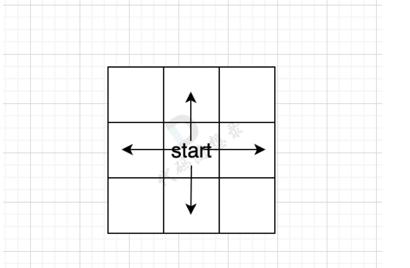
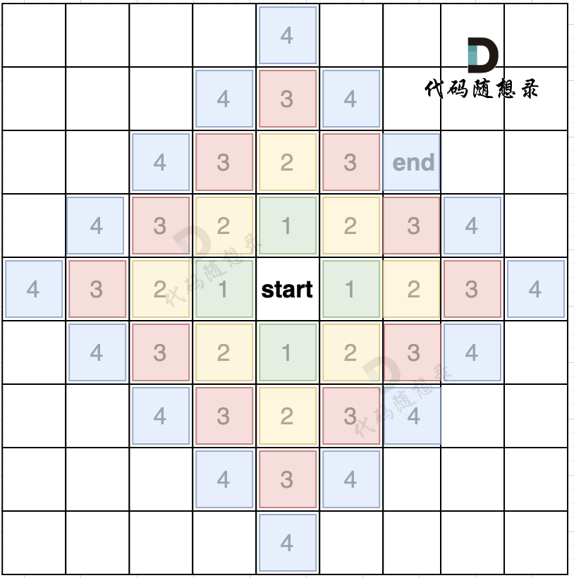
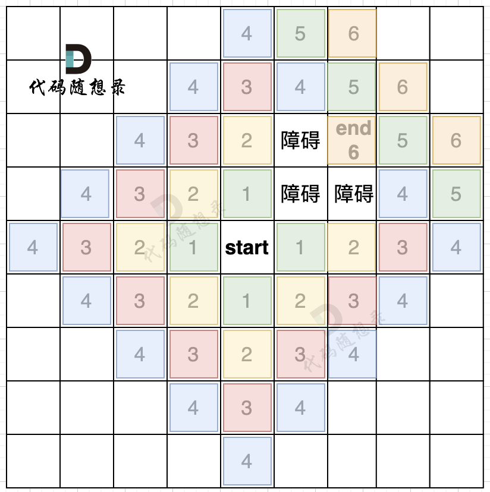

其实DFS就是一种回溯，所以基本和回溯的模板都一样

```
void dfs(参数) {
    if (终止条件) {
        存放结果;
        return;
    }

    for (选择：本节点所连接的其他节点) {
        处理节点;
        dfs(图，选择的节点); // 递归
        回溯，撤销处理结果
    }
}
```

BFS通常就是从start开始四个方向去搜索

如果再给一个终点end

也就是一圈一圈向外扩展。我们从图中可以看出，从start起点开始，是一圈一圈，向外搜索，方格编号1为第一步遍历的节点，方格编号2为第二步遍历的节点，第四步的时候我们找到终止点end。

正是因为BFS一圈一圈的遍历方式，所以一旦遇到终止点，那么一定是一条最短路径。

而且地图还可以有障碍，如图所示：


### 代码框架
大家应该好奇，这一圈一圈的搜索过程是怎么做到的，是放在什么容器里，才能这样去遍历。

很多网上的资料都是直接说用队列来实现。

其实，我们仅仅需要一个容器，能保存我们要遍历过的元素就可以，那么用队列，还是用栈，甚至用数组，都是可以的。

用队列的话，就是保证每一圈都是一个方向去转，例如统一顺时针或者逆时针。

因为队列是先进先出，加入元素和弹出元素的顺序是没有改变的。

如果用栈的话，就是第一圈顺时针遍历，第二圈逆时针遍历，第三圈有顺时针遍历。

因为栈是先进后出，加入元素和弹出元素的顺序改变了。

那么广搜需要注意 转圈搜索的顺序吗？ 不需要！

所以用队列，还是用栈都是可以的，但大家都习惯用队列了，所以下面的讲解用我也用队列来讲，只不过要给大家说清楚，并不是非要用队列，用栈也可以。

下面给出广搜代码模板，该模板针对的就是，上面的四方格的地图： （详细注释）
```
//BFS
private static final int[][] dir = 
//右上下左。
{{0, 1}, {1, 0}, {-1, 0}, {0, -1}}; // 表示四个方向

public void bfs(char[][] grid, boolean[][] visited, int x, int y) {
        Queue<int[]> queue = new ArrayDeque<>(); // 定义队列
        queue.offer(new int[]{x, y}); // 起始节点加入队列
        visited[x][y] = true; // 只要加入队列，立刻标记为访问过的节点
        while (!queue.isEmpty()) { // 开始遍历队列里的元素
            int[] cur = queue.poll(); // 从队列取元素
            int curX = cur[0];
            int curY = cur[1]; // 当前节点坐标
            for (int i = 0; i < 4; i++) { // 开始向当前节点的四个方向左右上下去遍历
                int nextX = curX + dir[i][0];
                int nextY = curY + dir[i][1]; // 获取周边四个方向的坐标
                if (nextX < 0 || nextX >= grid.length || nextY < 0 || nextY >= grid[0].length)
                    continue;  // 坐标越界了，直接跳过
                if (!visited[nextX][nextY]) { // 如果节点没被访问过
                    queue.offer(new int[]{nextX, nextY}); // 队列添加该节点为下一轮要遍历的节点
                    visited[nextX][nextY] = true; // 只要加入队列立刻标记，避免重复访问
                }
            }
        }
    }
```
