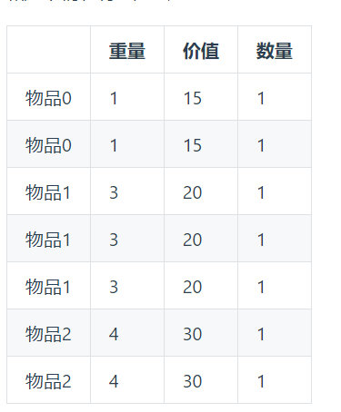

对于多重背包，我在力扣上还没发现对应的题目，所以这里就做一下简单介绍，大家大概了解一下。

多重背包其实就是物品的次数既不是01，也不是无穷。而是有限次数。比如3支笔，2本书，4个水杯。

多重背包和01背包是非常像的， 为什么和01背包像呢？

其实，把3支笔，拆成1支笔+1支笔+1支笔  其实就是一个01背包问题了。

例如：

背包最大重量为10。

物品为：

问背包能背的物品最大价值是多少？

和如下情况有区别么？

毫无区别，这就转成了一个01背包问题了，且每个物品只用一次。

其实多重背包，
